# Pack Christmas Project 2024

For this year’s holiday season, the SUSE Packaging Team is finally unveiling something that has been kept under lock and key for generations — our most treasured Christmas cookie recipes. Passed down through countless generations, these family secrets have been shrouded in mystery, shared only with the most trusted members of the family, carefully guarded, hidden from prying eyes, and locked away in dusty old recipe books, which only emerge on the rarest of occasions.

But this year, we’re breaking all tradition and sharing them with the world in the true open source spirit. We’re handing them over — in the most official and noble way possible — as properly packaged, spec-file culinary masterpieces.

We hope you enjoy these treats as much as we do. Whether you're baking them for your own holiday celebrations or just curious about how we package cookies.

Happy holidays from the SUSE Packaging Team
and don't forget to have a lot of fun

# Recipes
## [beehives](recipes/beehives/beehives.spec): No-Bake Czech Christmas Beehives

## [cookies-jam](recipes/cookies-jam/cookies-jam.spec): Favourite christmas cookies in my family

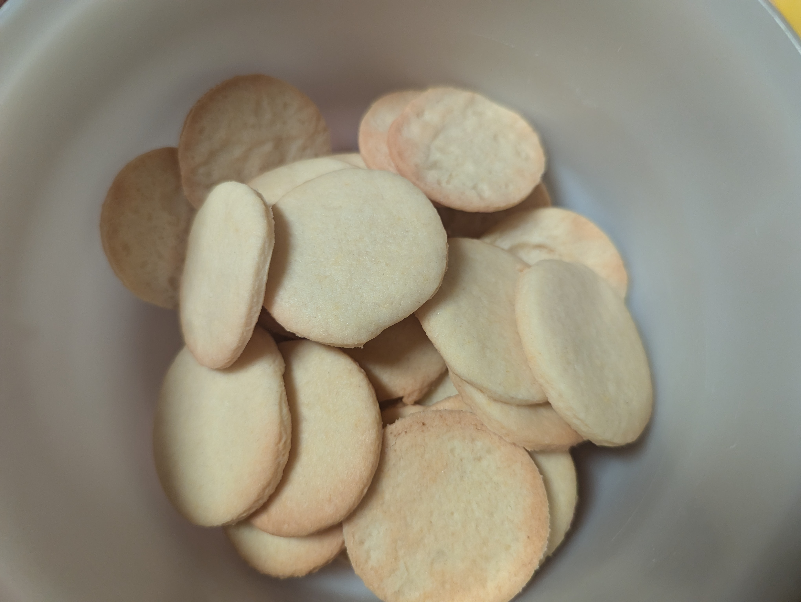
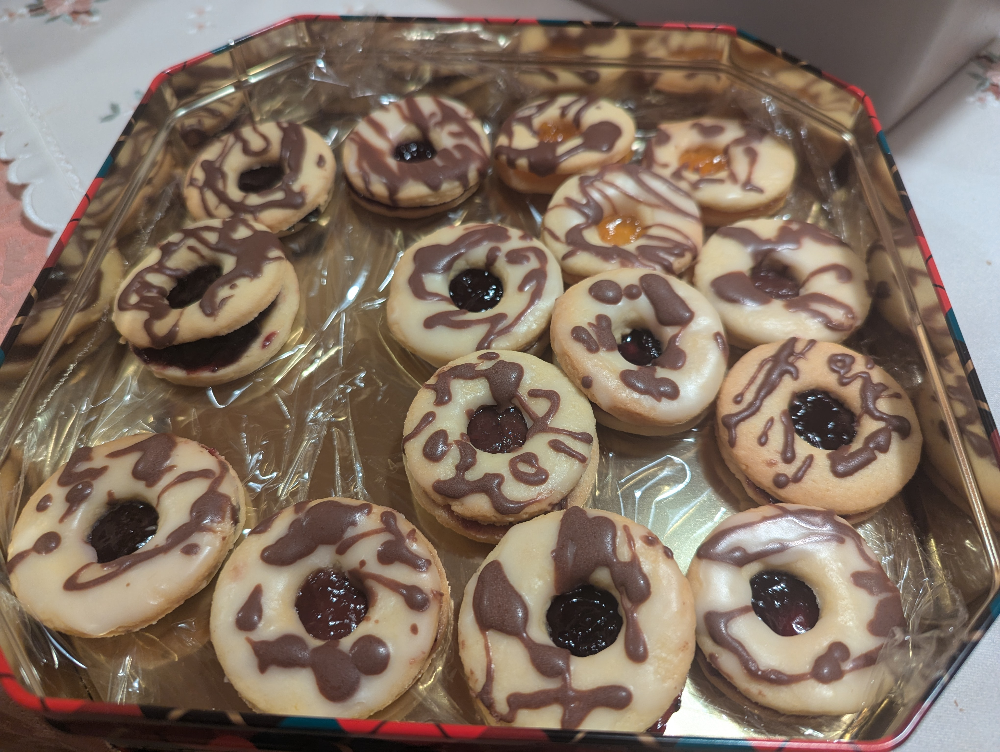
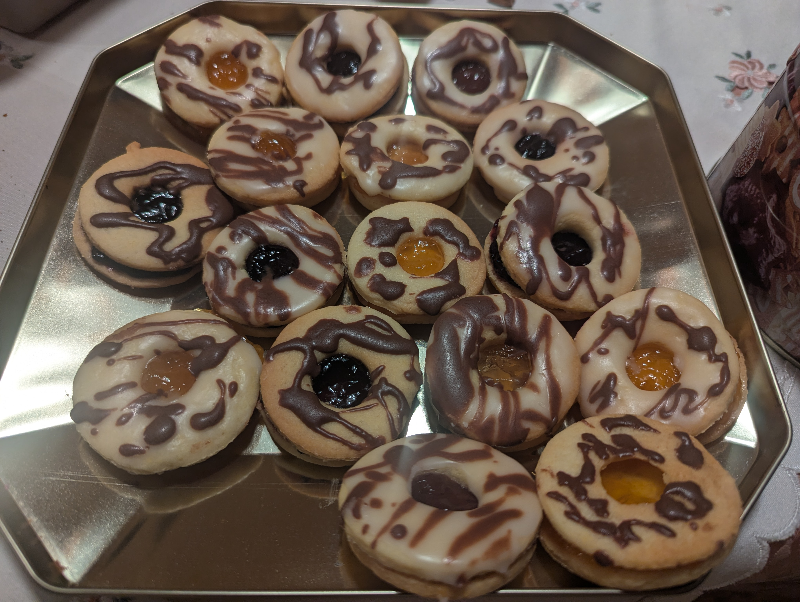
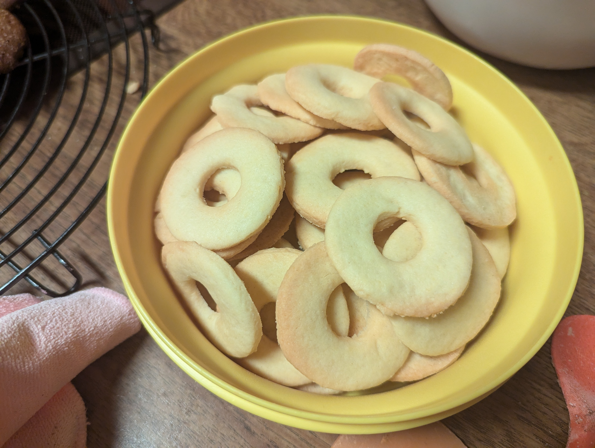

## [grandpa-cookies](recipes/grandpa-cookies/grandpa-cookies.spec): cookies a bit like gingerbread

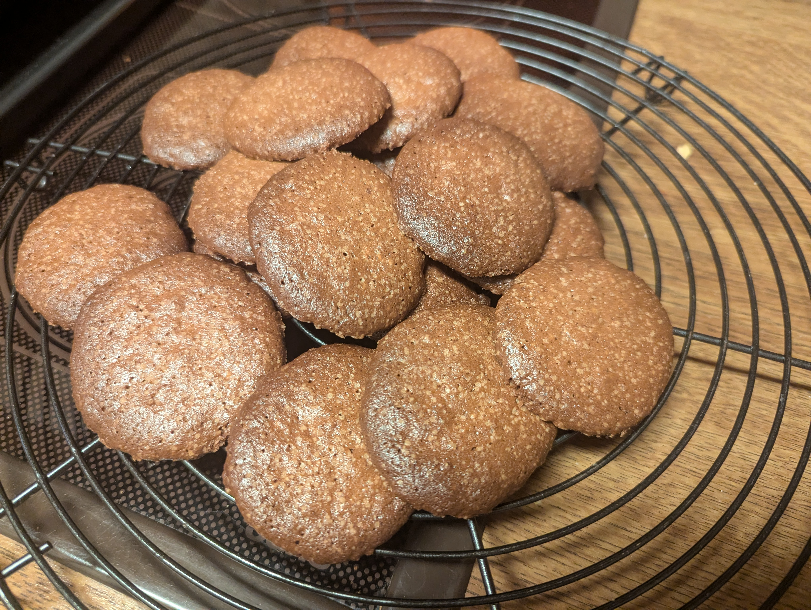

## [linzer-stars](recipes/linzer-stars/linzer-stars.spec): Traditional Czech Linzer Cookies for Christmas

## [vanilla-rolls](recipes/vanilla-rolls/vanilla-rolls.spec): Traditional Christmas sweet

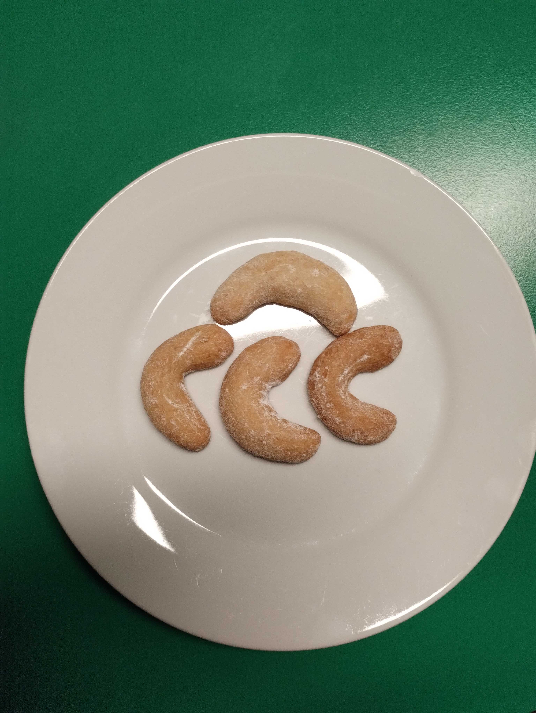

## [christmas-log](recipes/christmas-log/christmas-log.spec): Traditional French Christmas cake

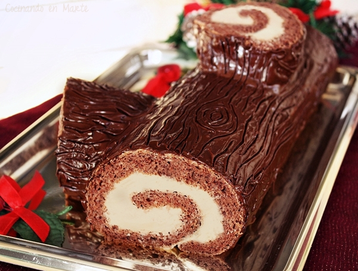

## [hedgehogs](recipes/hedgehogs/hedgehogs.spec): Christmas sweet treat

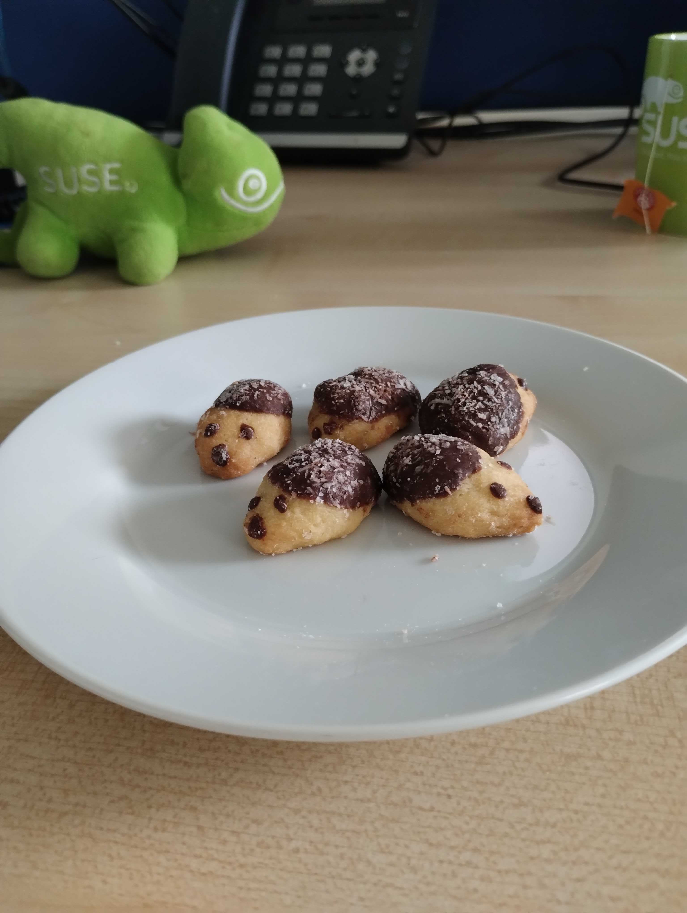

## [honey-gingerbread](recipes/honey-gingerbread/honey-gingerbread.spec): Traditional Czech Honey Gingerbread Recipe

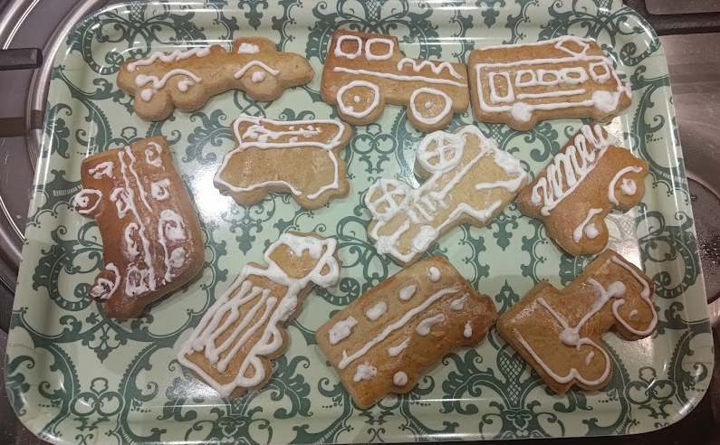

## [levander-cookies](recipes/levander-cookies/levander-cookies.spec): Levander Biscuit (Baked)

## [spritzgebaeck](recipes/spritzgebaeck/spritzgebaeck.spec): German X-Mas Cookie recipe

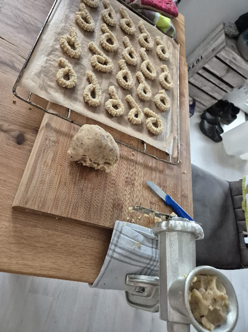

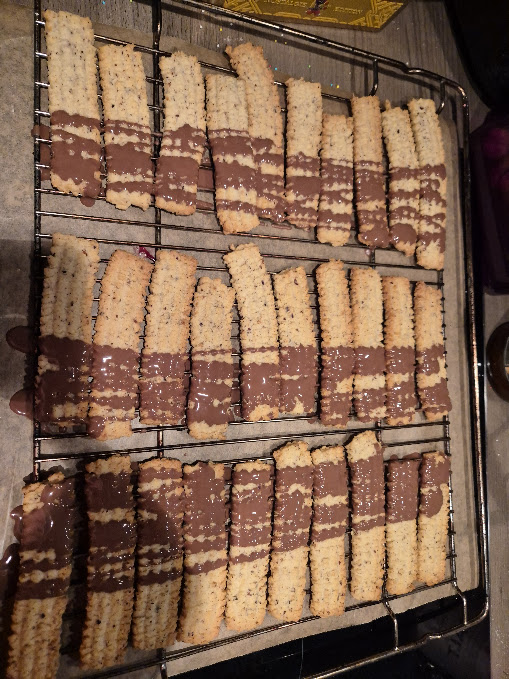

## [vanocka](recipes/vanocka/vanocka.spec): Traditional Czech Christmas Bread

